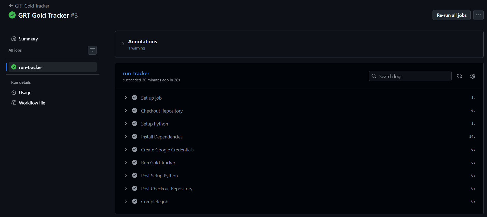

## 🔗 Gold-Rate-Tracker

## Automated Python-based gold rate monitoring system that tracks daily 22K gold prices, calculates investment weight acquisition, updates Google Sheets, and sends email notifications with trend analysis.

## 🔗 Overview

This project demonstrates an end-to-end automation workflow using Python, GitHub Actions, Google Sheets, and email notifications to monitor daily 22K gold rates from GRT Jewellers.

The application extracts the latest gold rate, calculates the gold weight acquired for a predefined investment amount, maintains historical records, tracks monthly highs and lows, analyzes day-over-day price movements, and automatically updates Google Sheets while sending email notifications.

The entire workflow is cloud-hosted and executes automatically through GitHub Actions without requiring manual intervention.

---

## 🔗 Objectives

- Track daily 22K gold rates automatically
- Calculate gold weight acquired for a fixed investment amount
- Maintain historical gold rate records
- Monitor monthly high and low prices
- Track day-over-day rate changes
- Automate reporting through Google Sheets and email notifications

---

## 🔗 Key Metrics

- Daily 22K Gold Rate
- Investment Amount
- Weight Acquired (grams)
- Monthly Low Rate
- Monthly High Rate
- Best Possible Grams
- Day-over-Day Price Difference

---

## 🔗 Project Workflow

1. Fetch daily 22K gold rate from GRT Jewellers
2. Extract and validate gold rate data
3. Calculate gold weight based on investment amount
4. Store historical records in CSV format
5. Update Google Sheets automatically
6. Analyze monthly high and low rates
7. Calculate day-over-day price changes
8. Generate and send email notifications
9. Execute automatically using GitHub Actions

---

## 🔗 Screenshots

### Google Sheets Output
*(Add screenshot here)*

### Email Notification
*(Add screenshot here)*

### GitHub Actions Workflow

---

## 🔗 Features

- Automated daily gold rate tracking
- Historical data storage and maintenance
- Gold weight calculation for investment planning
- Google Sheets integration
- Automated email notifications
- Monthly high and low rate analysis
- Day-over-day price difference tracking
- GitHub Actions automation
- Secure credential management using GitHub Secrets

---

## 🔗 Tools Used

- Python
- Pandas
- Requests
- Regular Expressions (Regex)
- Google Sheets API (gspread)
- SMTP Email Automation
- GitHub Actions
- GitHub Secrets

---

## 🔗 Data Sources

- GRT Jewellers Website
- Google Sheets
- Local CSV Historical Dataset

---

## 🔗 Key Insights

- Tracks daily fluctuations in 22K gold prices
- Identifies monthly low-rate opportunities for investment decisions
- Calculates gold weight acquired for a fixed investment amount
- Monitors day-over-day price movements and trends
- Provides automated reporting through cloud-based workflows
- Eliminates manual tracking and data entry

---

## 🔗 How to Use

1. Clone the repository
2. Configure Google Sheets credentials
3. Add GitHub Secrets for email and Google authentication
4. Update the investment amount in `config.json`
5. Run `main.py` locally or trigger the GitHub Actions workflow
6. Review updates in Google Sheets and email notifications
